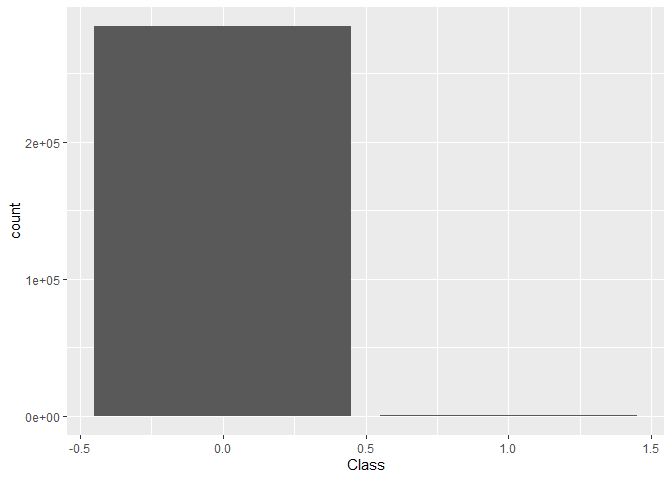
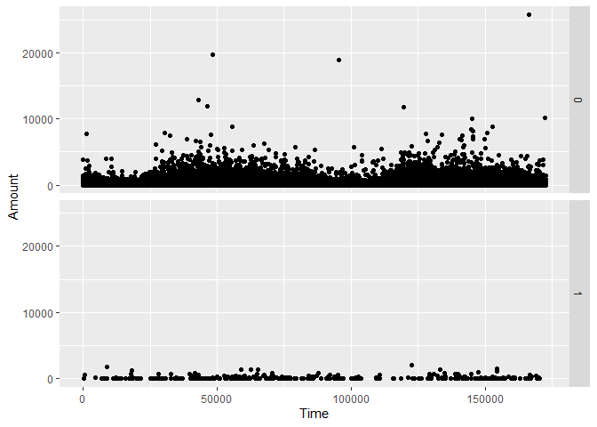
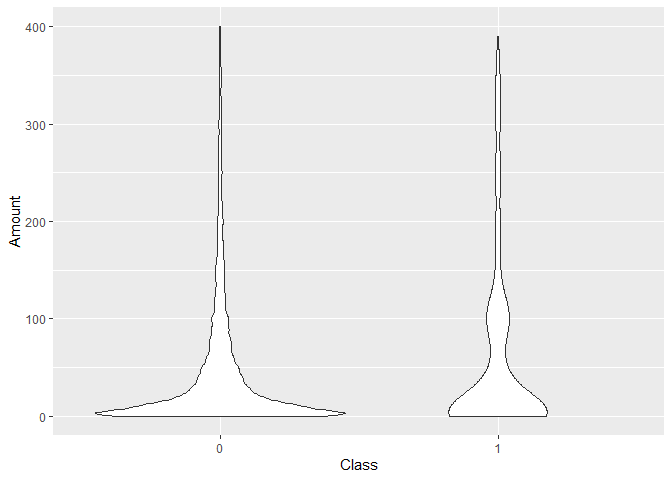
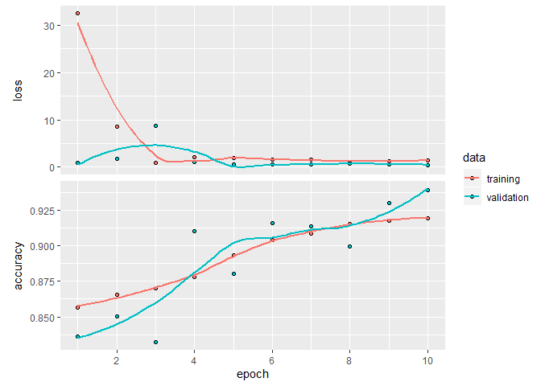
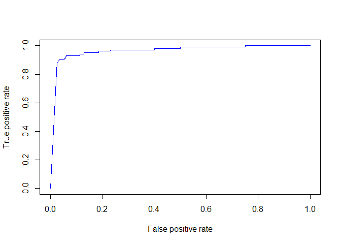
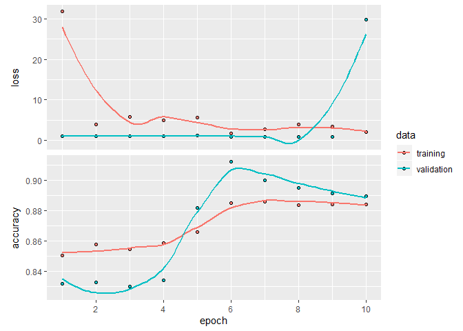
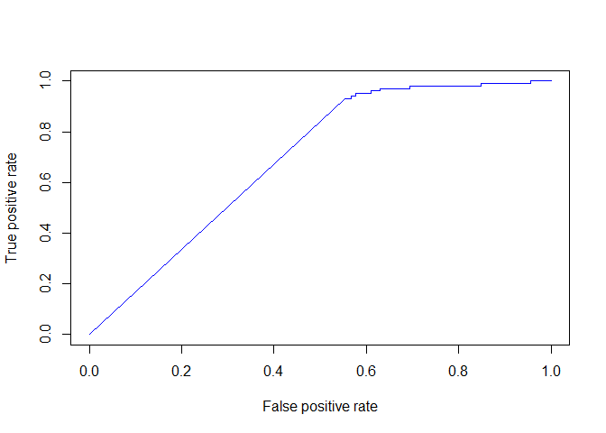

## Section 1: Installing Keras


```r
#Installing Keras
install.packages("devtools")
devtools::install_github("rstudio/keras")
install_keras()
```


```r
#Loading Keras library
library(keras)
```

## Section 2: Loading the dataset


```r
data <- read.csv('./creditcard.csv', stringsAsFactors = F)
head(data)
```

```
##   Time         V1          V2        V3         V4          V5          V6
## 1    0 -1.3598071 -0.07278117 2.5363467  1.3781552 -0.33832077  0.46238778
## 2    0  1.1918571  0.26615071 0.1664801  0.4481541  0.06001765 -0.08236081
## 3    1 -1.3583541 -1.34016307 1.7732093  0.3797796 -0.50319813  1.80049938
## 4    1 -0.9662717 -0.18522601 1.7929933 -0.8632913 -0.01030888  1.24720317
## 5    2 -1.1582331  0.87773675 1.5487178  0.4030339 -0.40719338  0.09592146
## 6    2 -0.4259659  0.96052304 1.1411093 -0.1682521  0.42098688 -0.02972755
##            V7          V8         V9         V10        V11         V12
## 1  0.23959855  0.09869790  0.3637870  0.09079417 -0.5515995 -0.61780086
## 2 -0.07880298  0.08510165 -0.2554251 -0.16697441  1.6127267  1.06523531
## 3  0.79146096  0.24767579 -1.5146543  0.20764287  0.6245015  0.06608369
## 4  0.23760894  0.37743587 -1.3870241 -0.05495192 -0.2264873  0.17822823
## 5  0.59294075 -0.27053268  0.8177393  0.75307443 -0.8228429  0.53819555
## 6  0.47620095  0.26031433 -0.5686714 -0.37140720  1.3412620  0.35989384
##          V13        V14        V15        V16         V17         V18
## 1 -0.9913898 -0.3111694  1.4681770 -0.4704005  0.20797124  0.02579058
## 2  0.4890950 -0.1437723  0.6355581  0.4639170 -0.11480466 -0.18336127
## 3  0.7172927 -0.1659459  2.3458649 -2.8900832  1.10996938 -0.12135931
## 4  0.5077569 -0.2879237 -0.6314181 -1.0596472 -0.68409279  1.96577500
## 5  1.3458516 -1.1196698  0.1751211 -0.4514492 -0.23703324 -0.03819479
## 6 -0.3580907 -0.1371337  0.5176168  0.4017259 -0.05813282  0.06865315
##           V19         V20          V21          V22         V23         V24
## 1  0.40399296  0.25141210 -0.018306778  0.277837576 -0.11047391  0.06692807
## 2 -0.14578304 -0.06908314 -0.225775248 -0.638671953  0.10128802 -0.33984648
## 3 -2.26185710  0.52497973  0.247998153  0.771679402  0.90941226 -0.68928096
## 4 -1.23262197 -0.20803778 -0.108300452  0.005273597 -0.19032052 -1.17557533
## 5  0.80348692  0.40854236 -0.009430697  0.798278495 -0.13745808  0.14126698
## 6 -0.03319379  0.08496767 -0.208253515 -0.559824796 -0.02639767 -0.37142658
##          V25        V26          V27         V28 Amount Class
## 1  0.1285394 -0.1891148  0.133558377 -0.02105305 149.62     0
## 2  0.1671704  0.1258945 -0.008983099  0.01472417   2.69     0
## 3 -0.3276418 -0.1390966 -0.055352794 -0.05975184 378.66     0
## 4  0.6473760 -0.2219288  0.062722849  0.06145763 123.50     0
## 5 -0.2060096  0.5022922  0.219422230  0.21515315  69.99     0
## 6 -0.2327938  0.1059148  0.253844225  0.08108026   3.67     0
```

## Section 3: Data Cleaning

### Section 3.1: Verifying the number of classes


```r
#Printing distinct values in the feature Class
unique(data$Class)
```

```
## [1] 0 1
```

### Section 3.2: Checking the timestamps to count the number of days they correspond to


```r
#Record the smallest timestamp in the dataset
first_timestamp <- min(data$Time)

#Record the last timestamp in the dataset
last_timestamp <- max(data$Time)

#Find the difference between the first timestamp in the dataset and the last
#timestamp in the dataset
last_timestamp - first_timestamp
```

```
## [1] 172792
```

Since the elapsed seconds between the first transaction and the last transaction in the dataset are less than 172,800, which is the number of seconds in two days, then the transactions in the dataset all occurred within two days. This verifies what is in the dataset description on Kaggle.

### Section 3.3: Checking if there are any missing values in the dataset 


```r
#We know that all the features in our dataset are numeric values. In R, the arithmetic #function on missing values returns an NA. So we will use the arithmetic mean 
#function to check if there are any missing values in the dataset

arithmetic_mean <- sapply(data, FUN=mean)
arithmetic_mean
```

```
##          Time            V1            V2            V3            V4 
##  9.481386e+04  1.166582e-15  3.118990e-16 -1.363448e-15  2.111334e-15 
##            V5            V6            V7            V8            V9 
##  9.796989e-16  1.510038e-15 -5.421869e-16  1.026743e-16 -2.422460e-15 
##           V10           V11           V12           V13           V14 
##  2.226073e-15  1.706405e-15 -1.243052e-15  8.353085e-16  1.228662e-15 
##           V15           V16           V17           V18           V19 
##  4.843927e-15  1.433674e-15 -3.777281e-16  9.760660e-16  1.038477e-15 
##           V20           V21           V22           V23           V24 
##  6.406672e-16  1.686181e-16 -3.380624e-16  2.673473e-16  4.474870e-15 
##           V25           V26           V27           V28        Amount 
##  5.105722e-16  1.684626e-15 -3.673341e-16 -1.230406e-16  8.834962e+01 
##         Class 
##  1.727486e-03
```

There were no returned NA values. Therefore, we don't have any missing values in our dataset. 


## Section 4: Exploratory data analysis

### Section 4.1: Looking into classes distribution 


```r
#Loading ggplot2 and dplyr libraries
library(ggplot2)
library(dplyr)
```

```
## 
## Attaching package: 'dplyr'
```

```
## The following objects are masked from 'package:stats':
## 
##     filter, lag
```

```
## The following objects are masked from 'package:base':
## 
##     intersect, setdiff, setequal, union
```


```r
#Plotting the count of each class on a bar chart
data %>% ggplot(aes(Class))+geom_bar()
```

<!-- -->

### Section 4.2: Correlation matrix and correlogram 


```r
#Calculating the correlation matrix 
data.cor = cor(data)
```


```r
#Installing the corrplot package
install.packages("corrplot")
```


```r
#Loading the carrplot library
library(corrplot)
```

```
## Warning: package 'corrplot' was built under R version 3.6.3
```

```
## corrplot 0.84 loaded
```


```r
#Plotting a correlogram
corrplot(data.cor)
```

<!-- -->


### Section 4.3: The pattern between time and the transaction amount 


```r
#Plotting transaction amount versus time by class 
data %>% ggplot(aes(Time,Amount))+geom_point()+facet_grid(Class~.)
```

<!-- -->

### Section 4.4: Filtering out transactions less than 400 and plotting transaction amounts by class


```r
data$Class <- as.factor(data$Class)
data %>% filter(Amount<400) %>% ggplot(aes(Class,Amount))+geom_violin()
```

<!-- -->

## Section 5: Data Analysis

### Section 5.1: Splitting the dataset into a training set and a testing set. Also, dropping Time and Class features from the training set. 


```r
#Setting aside 20% of the data as a testing set and 80% as a training set
index <- sample(nrow(data), size=0.2*nrow(data))
training_set <- data[-index,]
testing_set <- data[index,]

#Setting the response variable for both the testing and training sets. This will be used later #to evaluate the model performance
y_training_set <- training_set$Class
y_testing_set <- testing_set$Class

#Excluding labels (Time and Class) from the X_training and X_testing sets
X_training_set <- training_set %>% select(-one_of(c("Time","Class")))
X_testing_set <- testing_set %>% select(-one_of(c("Time","Class")))

#Turning the data frame into a matrix 
X_training_set <- as.matrix(X_training_set)
X_testing_set <- as.matrix(X_testing_set)
```


### Section 5.2: The first autoencoder neural network architecture

```r
#Based on our dataset the input and output dimensions will be 29. We will just define one #variable and use it for both the outer layer and the inner layer
input_layer_dimension <- 29

#Defining the number of neurons in the outer layer
neurons_in_outer_layer <- 15

#Defining the number of neurons in the inner layer
neurons_in_inner_layer <- 10

#Defining the input layer of the network which is also the first encoder layer
input_layer <- layer_input(shape=c(input_layer_dimension))

#Defining the encoder of the network and using ReLU as an activation function
encoder <- layer_dense(units=neurons_in_outer_layer,activation='relu')(input_layer)
encoder <- layer_dense(units=neurons_in_inner_layer, activation='relu')(encoder)

#Transation from the encoder which is the first decoder layer
decoder <- layer_dense(units=neurons_in_inner_layer)(encoder)

#Defining decoder layers
decoder <- layer_dense(units=neurons_in_outer_layer)(decoder)
decoder <- layer_dense(units=input_layer_dimension)(decoder)

#Defining the neural network using the encoders and decoders we specified above
autoencoder_arch1 <- keras_model(inputs=input_layer, outputs = decoder)
```


```r
#Compiling the model using mean square error as a loss function and accuracy as a metics
autoencoder_arch1 %>% compile(optimizer='adam',loss='mean_squared_error',
                              metrics=c('accuracy'))

#Fitting the model and saving the results in the variable "steps"
#Here we specified the batch size as 30 and the number of epochs as 10
#Also, the validation split is set to 0.2
steps  <- autoencoder_arch1 %>% fit(X_training_set,X_training_set, epochs = 10, batch_size = 30, validation_split=0.2)
```


```r
#Plotting the results to show the accuracy and loss values for each epoch
plot(steps)
```

<!-- -->


### Section 5.3: Making predictions using the trained network and test data, defining the threshold for reconstruction errors, and plotting the precision-recall curve.

```r
#Making predictions using the trained network and test data
predictions <- autoencoder_arch1 %>% predict(X_testing_set)
predictions <- as.data.frame(predictions)
```


```r
#Setting the threshold for the reconstruction errors to 40
y_predictions <- ifelse(rowSums((predictions - X_testing_set)**2)/40<1,rowSums((predictions - X_testing_set)**2)/40,1)
```


```r
#Plotting the precision-recall curve
library(ROCR)
```

```
## Loading required package: gplots
```

```
## 
## Attaching package: 'gplots'
```

```
## The following object is masked from 'package:stats':
## 
##     lowess
```

```r
predic <- prediction(y_predictions, y_testing_set)
perform <- performance(predic, measure = "tpr", x.measure = "fpr")
plot(perform, col='blue')
```

<!-- -->

### Section 5.4: The second autoencoder neural network architecture


```r
#Based on our dataset the input and output dimensions will be 29. We will just define one #variable and use it for both the outer layer and the inner layer
input_layer_dimension <- 29

#Defining the number of neurons in each inner layer
neurons_in_first_inner_layer <- 20
neurons_in_second_inner_layer <- 12
neurons_in_third_inner_layer <- 6
neurons_in_fourth_inner_layer <- 3

#Defining the input layer of the network
input_layer <- layer_input(shape=c(input_layer_dimension))

#Defining the encoder of the network and using ReLU as an activation function
encoder <- layer_dense(units=neurons_in_first_inner_layer,activation='relu')(input_layer)
encoder <- layer_dense(units=neurons_in_second_inner_layer, activation='relu')(encoder)
encoder <- layer_dense(units=neurons_in_third_inner_layer, activation='relu')(encoder)
encoder <- layer_dense(units=neurons_in_fourth_inner_layer, activation='relu')(encoder)

#The first layer of the decoder
decoder <- layer_dense(units=neurons_in_fourth_inner_layer)(encoder)

#Defining the decoder layers
decoder <- layer_dense(units=neurons_in_third_inner_layer)(decoder)
decoder <- layer_dense(units=neurons_in_second_inner_layer)(decoder)
decoder <- layer_dense(units=neurons_in_first_inner_layer)(decoder)
decoder <- layer_dense(units=input_layer_dimension)(decoder)

#Defining the neural network using the encoders and decoders we specified above
autoencoder_arch2 <- keras_model(inputs=input_layer, outputs = decoder)
```


```r
#Compiling the model using mean square error as a loss function and accuracy as a metics
autoencoder_arch2 %>% compile(optimizer='adam',loss='mean_squared_error',
                              metrics=c('accuracy'))

#Fitting the model and saving the results in the variable "steps".
#Here we specified the batch size as 30 and the number of epochs as 10
#Also, the validation split is set to 0.2 
steps_2  <- autoencoder_arch2 %>% fit(X_training_set,X_training_set, epochs = 10, batch_size = 30, validation_split=0.2)
```


```r
#Plotting the results to show the accuracy and loss values for each epoch
plot(steps_2)
```

<!-- -->


### Section 5.5: Making predictions using the trained network and test data, defining the threshold for reconstruction errors, and plotting the precision-recall curve.


```r
#Making predictions using the trained network and test data
predictions_2 <- autoencoder_arch2 %>% predict(X_testing_set)
predictions_2 <- as.data.frame(predictions_2)
```


```r
#Setting the threshold for the reconstruction errors to 40
y_predictions_2 <- ifelse(rowSums((predictions_2 - X_testing_set)**2)/40<1,rowSums((predictions_2 - X_testing_set)**2)/40,1)
```


```r
#Plotting the precision-recall curve
library(ROCR)
predic_2 <- prediction(y_predictions_2, y_testing_set)
perform_2 <- performance(predic_2, measure = "tpr", x.measure = "fpr")
plot(perform_2, col='blue')
```

<!-- -->

